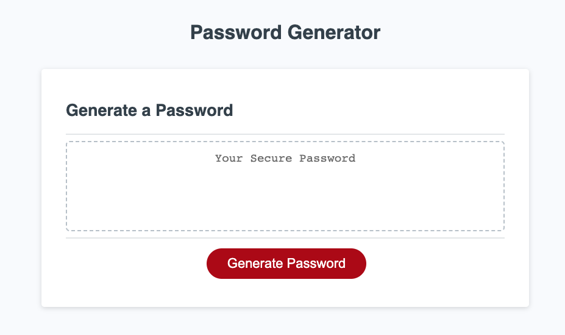
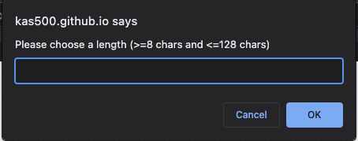
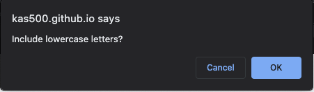
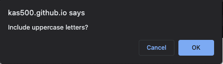
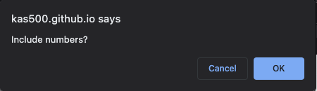
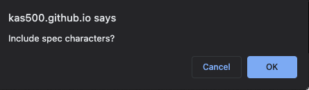
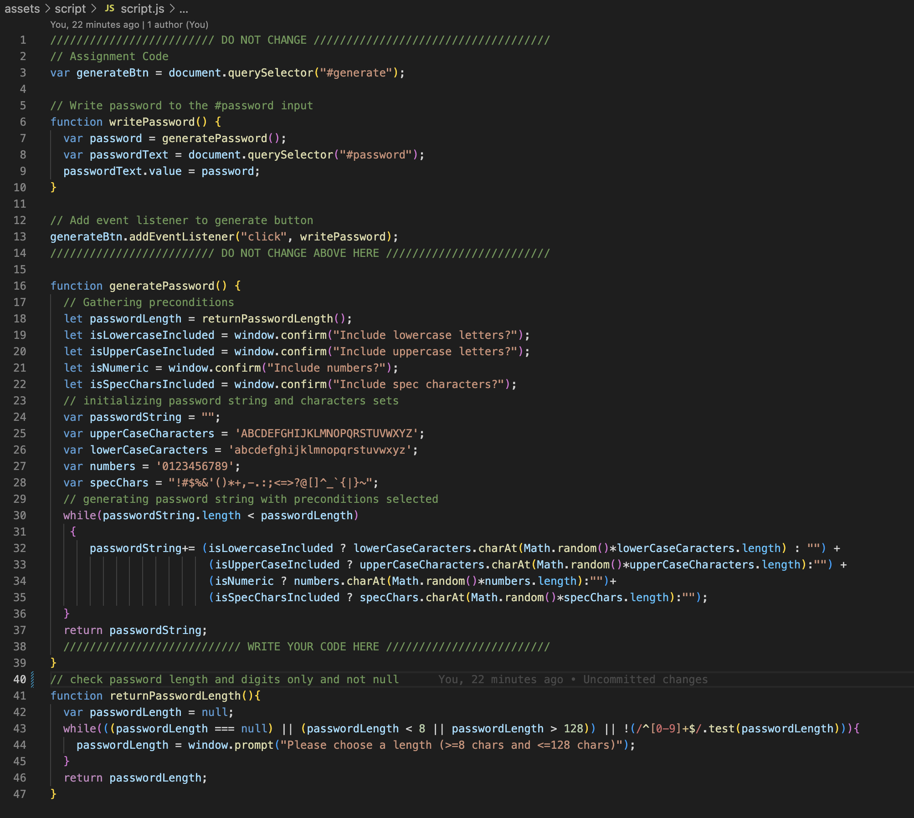

# Password-generator web app. Homework #3

Password generator is a web application which was created as part of Homework #3. The algorithm was written using the Javascript programming language.  Such language constructs as a loop, various methods for working with string values ​​were used.  The ternary operator was also applied when constructing the password string.  The skills of creating and calling functions were also applied. Additionally, regular expressions were used to check the correct input of preconditioning data.

## Usage

The project was deployed using Github hosting and is available at the link https://kas500.github.io/password-generator/ .

When you click on the "Generate Password" button, the app offers several prerequisites that will be applied during the process of generating a password string.

## Screenshots

### Main page. Pic 1

### Prompt box (password length). Pic 2

### Confirm box (lowercase letters). Pic 3

### Confirm box (uppercase letters). Pic 4

### Confirm box (numbers). Pic 5

### Confirm box (special characters). Pic 6

### Script source code. Pic 7

